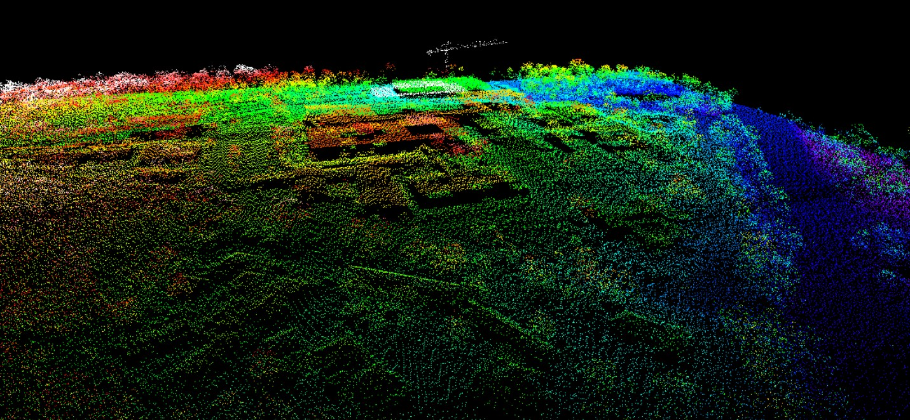
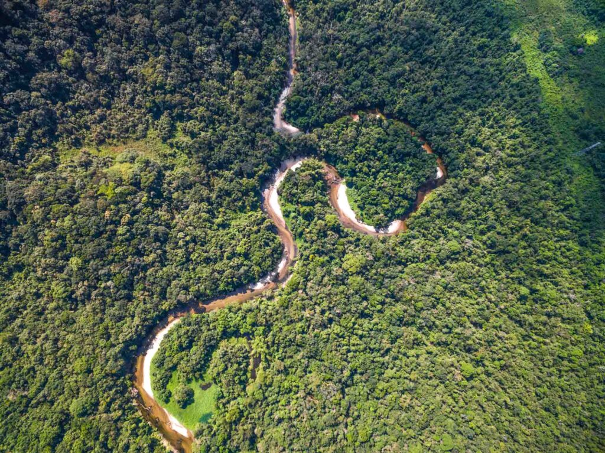
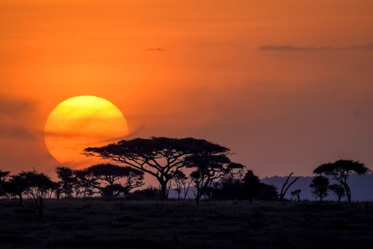

class: center, middle

# GEDI
## **Global Ecosystem Dynamics Investigation**

  
  

  International Space Station and LiDAR point cloud

  Images hosted in the public domain

---
class: left, middle

# What is GEDI

.pull-left[
### Details and Purpose
- Initiated March 2019
- Mounted on the ISS  
  - All Year, Global LiDAR Imaging  
- Active Sensor  
- Point Cloud of Earth's Ecosystems
    - Tundra, Forest, Savannah, etc
- Helps determine changes in the carbon cycle
- Learn more at GEDI's 
  - [NASA Page](https://www.earthdata.nasa.gov/data/projects/gedi)
- And
  - [ESA Eoportal Page](https://www.eoportal.org/satellite-missions/iss-gedi#iss-utilization-gedi-global-ecosystems-dynamics-investigation-lidar)
]

.pull-right[

  
  

    Amazon Rainforest: Brazil
  

]

  Images hosted in the public domain

---
class: left, middle

# Questions, Comments, Concerns 

.pull-left[

  
  

  

### Open Source Data
- GEDI data can be attained through [NASA's Data Portal](https://data.nasa.gov/)
  - Provides base for collaborative work between multiple organizations
]

.pull-right[
### Resolution
- GEDI records pulses in fine, 25m cycles, but production of data results in resolution of 1km.
  - This limits GEDI to large scale projects.
  - More local projects may benefit more from drone LiDAR

### Questions
- Can GEDI be used in a more Urban context?
  - Change detection in urban growth?
  - Measure the success of urban forestry?
]

  Images hosted in the public domain

---
class: center, middle, inverse
# Evaluation of GEDI footprint level biomass models in Southern African Savannas using airborne LiDAR and field measurements 
### Li, Wessels et al. 

---
class: left, middle

# Application

.pull-left[
In this study, GEDI was used in conjunction with Airborne LiDAR (ALS) to assess the biomass of savannas in South Africa. Initially the openly available world GEDI biomass model was used to model/predict the biomass of the area of study. [@li_evaluation_2024] found that the global GEDI data was not able to accurately model/predict the biomass in part because of the previously mentioned 1km data resolution. However, using training data collected by the more locally calibrated ALS, a model using the point cloud from the ALS and global GEDI metrics was able to significantly increase the predictive accuracy of the model while demonstrating that GEDI is sufficiently robust to use in a local model as long as local data is used for the training. 
]

.pull-right[

  
  

    Savanna: Namibia
  

]

  Images hosted in the public domain

---
class: center, middle, inverse

# Assessing protected area’s carbon stocks and ecological structure at regional-scale using GEDI lidar
### Liang, González-Roglich et al. 

---
class: left, middle

# Application

.pull-left[

  
  

    Serengeti National Park: Tanzania
  

]

.pull-right[
In contrast to the previous study which looked to assess GEDI's capabilities at more local levels, this project assess GEDI at a regional level in Tanzania. To do this, [liang_assessing_2023] hypothesizes that protected areas (PA) in Tanzania are more efficient carbon sinks than comparable (size, vegetation) unprotected areas. Using GEDI LiDAR, the authors noted significantly higher biomass density, forest heights, and canopy cover in protect areas as opposed to unprotected areas. Additionally, the authors were able to deduce that smaller PAs were more efficient carbon sinks than larger PAs, suggesting a gradient of efficiency within PAs.This demonstrates GEDI as incredible efficient in its original design purpose, as a regional determinant of ecosystem carbon footprint.
]

  Images hosted in the public domain

---
class: left, middle

# Reflection

.pull-left[
### Why I find GEDI Interesting
Dr. Konrad Wessels from George Mason University (co-author of the first paper) was the first person to introduce me to GEDI data in a seminar class I took around 3 years ago. He presented a previous version of the South African savanna work shared above and I found the combination of machine learning and remote sensing quite enthralling. I have personally never used GEDI data in a project, but GEDI and LiDAR sensors in general remain my primary interest in the realm of R.S.
]

.pull-right[
### What's next?
As displayed quite clearly in the papers, GEDI (given the right circumstance) is a perfectly viable tool for both regional and local projects, however it still seems limited in the urban world; making it less relevant to our field of study in CASA. That being said I already mentioned it may be useful in detecting urban growth and urban forestry, but perhaps GEDI can also serve as the base for models estimating the effects of climate change on our cities. 
]

---
# References

::: references
:::

